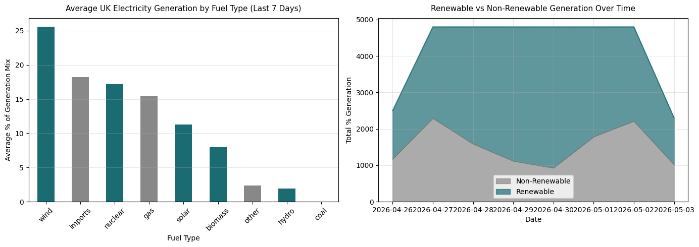

# ETL Energy Pipeline

An end-to-end ETL pipeline built in Python that extracts 
real-time UK electricity generation data, transforms and 
validates it, loads it into a SQLite database, and 
visualises energy mix trends.

## What it does
- **Extract** — fetches live data from the UK Carbon Intensity 
  API (National Grid ESO)
- **Transform** — cleans, validates, and enriches the data 
  (null checks, deduplication, renewable flagging)
- **Load** — stores structured data in a SQLite database
- **Analyse** — queries the database with SQL and produces 
  visualisations

## Results


## Key findings
- Wind and gas dominate the UK generation mix
- Renewable contribution varies significantly hour-by-hour
- Zero null values or duplicates found after transformation

## Tech stack
Python · pandas · SQLite · SQLAlchemy · 
requests · matplotlib · UK Carbon Intensity API

## How to run
Open in Google Colab or run locally:
```bash
pip install requests pandas matplotlib sqlalchemy
jupyter notebook etl_energy_pipeline.ipynb
```

## Author
Lovely Bhadouria — [LinkedIn](https://linkedin.com/in/lovely-singhdeveloper)
